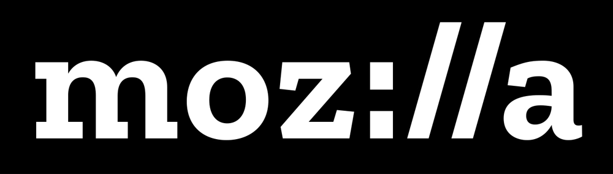
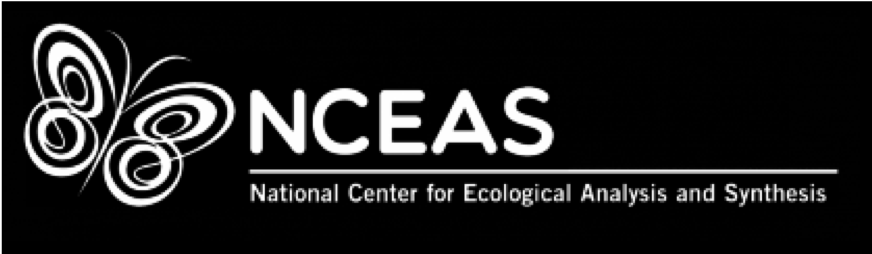
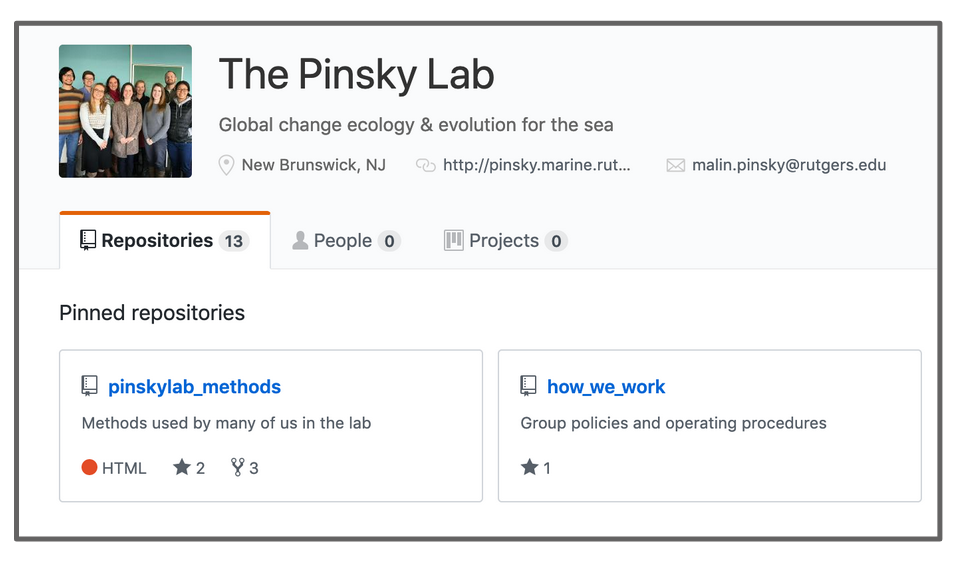
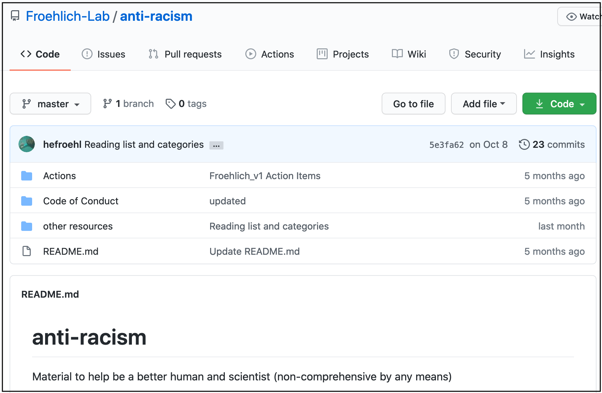

```{r setup, include=FALSE}
options(htmltools.dir.version = FALSE, warning=FALSE, message=FALSE, verbose = FALSE)
knitr::opts_chunk$set(echo = FALSE, message=FALSE, warning=FALSE)

library(xaringan)
# library(fontawesome) #devtools::install_github("rstudio/fontawesome")
# library(icon) #devtools::install_github("ropenscilabs/icon")
```

class: title-slide, right, bottom
background-image: url(images/horst-starwars-rey.jpg)
background-size: contain
background-position: bottom left 


## `r rmarkdown::metadata$title`
### `r rmarkdown::metadata$author`
### `r rmarkdown::metadata$institute`

[@juliesquid](https://twitter.com/juliesquid)  
[openscapes.org/media](http://openscapes.org/media)  




???

Thank you so much. I'm really excited to be here today to talk about R and teamwork for better science in less time. 

I'm so happy to have the chance to speak with you all today because —

---
# Hello. I'm Julie. 

I'm a marine ecologist turned open data science champion

2 pics: squid release, teaching at mbari

---
# open science is a movement that will help you do BSILT. You engage with this movement through teams.

Key takeaway: 

Main point:: Open, Reliable, and Transparent is a team effort:  And what I'd like you to leave this talk with is the idea that teams and community are all around you, supporting you in your research. 

THEME: As open science improves your daily life, you can also give back and help others. This is what the open science movement is. 

---
# SEEDS slide 2

https://docs.google.com/presentation/d/1Mc__4NfMlLHvChoAWnvEqUocP8JS9Ya317hHRaZhLnM/edit#slide=id.gbb069af1de_0_815

Maybe Slide 3 too

??
Means so much I've moved away from doing my own research to pass forward. 

Mozilla Fellowship, Openscapes, operated at NCEAS, Co-directed with Erin Robinson. 

---
Luke

We're always going to find ourselves in situations where we don't have the skillsets to solve the challenges we face. 

---
Yoda

But there are powerful approaches around us, as powerful as the force. This is open science. There are mentors around us that can help, and although it's real work to upskill, we can become confident in the skills we need

---
team

and become part of a team. We all do science, so we all are on many teams of different scales. The most clear is our own lab, then the open source community 

---
## Open science as a movement

Define open science? 
GOTV. 

Daily benefit that then you can pass forward. 

DEI is a huge part of this.

SORTEE GSlide 7: https://docs.google.com/presentation/d/1HGw4P095-lblHiGQHXYidHiVysjrPxuojxTxKtE13vk/edit#slide=id.gddac11ba17_0_174

Co-create, less re-inventing. more inclusion and belonging.

(Feedback loop?)

---
R communities

We got into open science because we were deliberately welcomed by the R community. ODS is like the Force, it's not something youre' going to come up with on your own unless you see adn are welcomed. 

First some background:

---
# SEEDS OHI slides

7-9: https://docs.google.com/presentation/d/1Mc__4NfMlLHvChoAWnvEqUocP8JS9Ya317hHRaZhLnM/edit#slide=id.g7a1c47daec_1_2009


---
# BSILT feedback:

we're not a team. Chelsea quote? I didn't realize there was a problem

---
# DEI is a huge part of this. 

---
# Champions illustration

Focus is on helping researchers find their teams and communities. Explore and navigate
Join the open science movement

Not just about tools, DEI

---
# Main message

## 2 sub-messages

---
# Sub-message #1 
Code collaboratively (for future us?)


---
# Ex with ohicore (OHI hex)
several slides


---
class: middle
.pull-left[
```{r pinskylab, out.width = '100%'}

```
.footnote[github: [@pinskylab](https://github.com/pinskylab)]

]

.pull-right[
```{r froehlich-lab, out.width = '100%'}

```


.footnote[
github: [@froehlich-lab](https://github.com/Froehlich-Lab/anti-racism)
]
]


---
class: inverse, center, middle
## It’s like agreeing that we will all drive on the left or the right. A hallmark of civilization is following conventions that constrain your behavior a little, in the name of public safety.

**Jenny Bryan & Jim Hester, [What They Forgot to Teach You About R](https://rstats.wtf/)**


---
# Submessage #2
Communicate collaboratively (for future us)

RMarkdown. (7 min)

---
Rmd also helped us teach and iterate

- OHI training modeled after Carpentries' structure, but to onboard people to our workflow. 
- this is now an incubator at the Carpentries and was part of the foundation for
- R for Excel taught at RSTudio Conf
Allowed us to give back 

---
Champion example: Gavin Fay

---
NASA too. 

- introduce another layer: Mentors cohort

new 

---
Kinder science

---
# How you get involved 

- start talkign about data
- identify and address shared needs
- think ahead for future us. 

---
# Twitter 

https://openscapes.github.io/slides/betterscience/environment-canada#19

---
name: goodbye
class: bottom
background-image: url("images/fam.png")
background-size: 40%
background-position: 1% 99%

.pull-left[
### Our extended family:
+ Garrick Aden-Buie,
+ Carson Sievert,
+ Charles Teague,
+ Hadley Wickham, 
+ JJ Allaire, and
+ Rich Iannone.

*All illustrations by [Allison Horst](https://www.allisonhorst.com/).*
]


.pull-right[
.right[


# Thank you!

### Find us elsewhere at...

[`r fontawesome::fa("link")` rmarkdown.rstudio.com](https://rmarkdown.rstudio.com)  
[`r fontawesome::fa("stroopwafel")` rmarkdown cookbook](https://bookdown.org/yihui/rmarkdown-cookbook/)  
[`r fontawesome::fa("blog")` blog.rstudio.com](https://blog.rstudio.com/categories/r-markdown/)  
[`r fontawesome::fa("box-open")` pkgs.rstudio.com](https://pkgs.rstudio.com/)  
[`r fontawesome::fa("youtube")` youtube](https://youtube.com/playlist?list=PL9HYL-VRX0oTZhAhlLb8r6DI04KY46RJW) 
]
]


