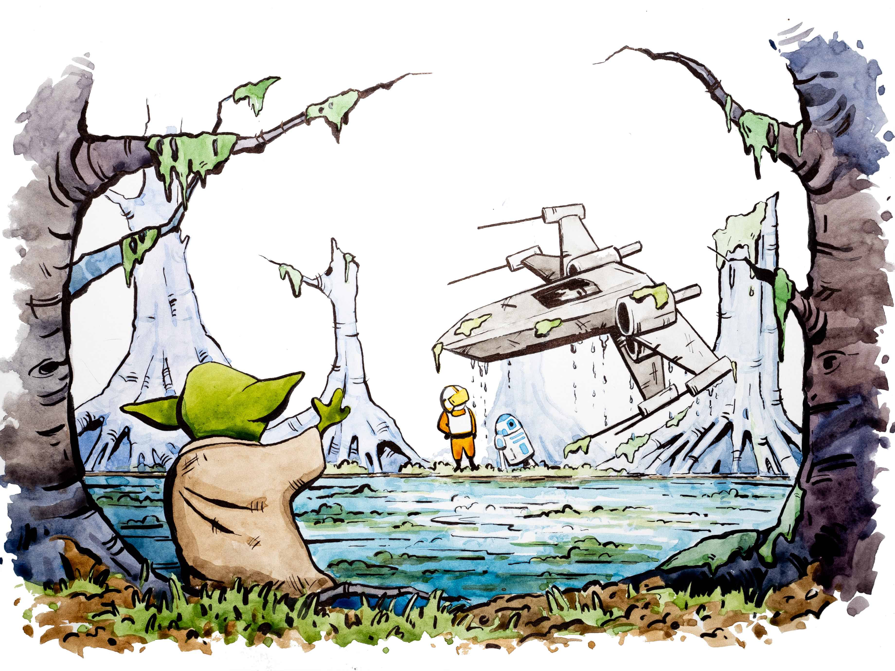
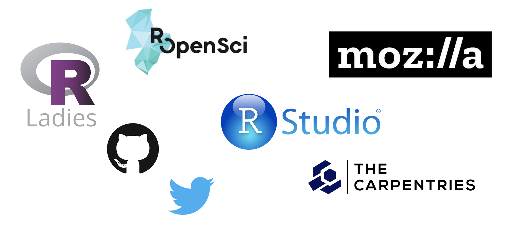
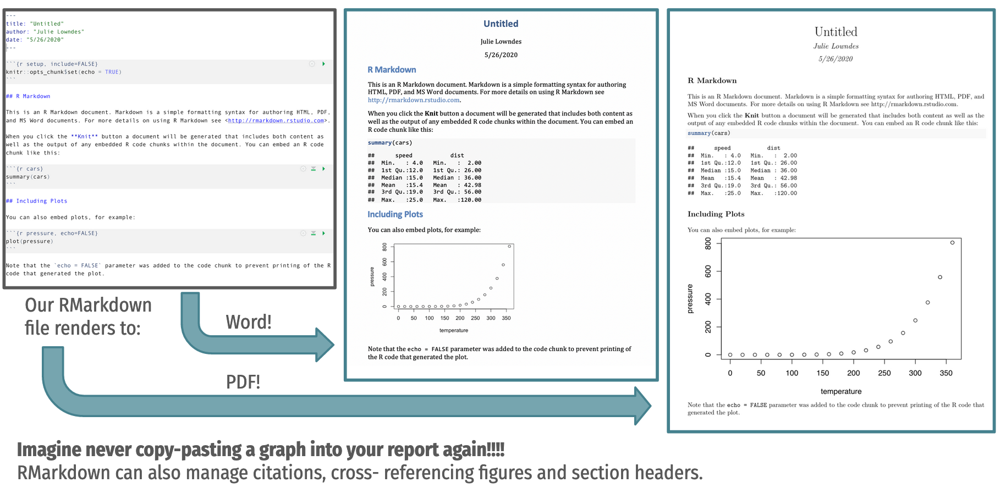
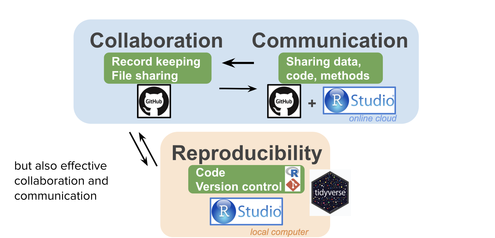

```{r setup, include=FALSE}
options(htmltools.dir.version = FALSE, warning=FALSE, message=FALSE, verbose = FALSE)
knitr::opts_chunk$set(echo = FALSE, message=FALSE, warning=FALSE)

library(xaringan)
# library(fontawesome) #devtools::install_github("rstudio/fontawesome")
# library(icon) #devtools::install_github("ropenscilabs/icon")
```

class: title-slide, right, bottom

## `r rmarkdown::metadata$title`
### `r rmarkdown::metadata$author`
### `r rmarkdown::metadata$institute`

Twitter: [@juliesquid](https://twitter.com/juliesquid)  
Slides: [openscapes.org/media](http://openscapes.org/media)  
All Artwork by [Allison Horst](https://twitter.com/allison_horst)


???

Thank you so much. I want to start off by honoring the land where I am. As an ecologist, the land and water is part of my life's work and I want to honor the Chumash peoples who have been and continue to be stewards of the lands and waters where I am here in Santa Barbara, California. So thank you. 

I'm really excited to be here today to talk about Openscapes: Better Science for Future Us

Better science is science that is more open and reproducible, it's more diverse, equitable, inclusive, and just, and it is for Future Us: the ideas of our teams, and communities, and who will be joining and continuing our work, whether that is next week or next century. Future Us is an important mindset for science and society at large, and particularly important in environmental science.  

<!---
Better science for Future Us is about spending less time reinventing and more time collaborating and co-creating, and --->

transition: it's particularly important for us in  data-intensive science,  because default approaches to data-intensive research feel like this. 

---
name: luke
class: top
background-image: url(images/horst-starwars-luke.jpg)
background-size: contain

???

Data-intensive science can be super lonely and demoralizing. Like Luke Skywalker here, we’ve all had moments where we are staring at a challenge that we can’t solve with the skillsets we have and we can't solve it alone. As a marine ecologist I felt demoralized like this when I was a graduate student first learning how to code, and then again with my research team as we were struggling to collaborate with code. Being unprepared to work responsibly with data and to work collaboratively slows us down and slows our science down, and slows our solutions down. And it's really a negative feedback loop where we feel more and more alone, behind, and like it’s too late to catch up.

But it doesn’t have to be like this –

---
class: top, center
```{r yoda, out.width = '88%'}
 
```


???

Open science is collaborative and empowering – it’s like the Force from Star Wars. Like the Force, open science enables us to solve data challenges in ways we never would have imagined was possible. Open science is something we can see and learn and become confident with, and collaborate around, and it doesn’t just help us get unstuck from the current challenge in front of us, it also broadens our mindsets for the scope and scale of the research questions we can tackle. I felt the power of open science first through the R community who supported me as a new learner and helped me feel like I wasn’t alone and that it wasn’t too late.


---
class: center, middle
background-image: url(images/horst-starwars-hands.jpg)  
background-size: contain


???

And so like the Force, open science is something that brings us together. Diverse, inclusive teams and communities are key here, so that we can learn from each other’s expertise and experiences and work together to address pressing issues like climate change and climate justice that none of us can do alone. 

So these ideas of data science, open science, and teamwork are the key motivators of Openscapes. 

And when we’re not thinking of open science like the Force –

---
class: center, middle
background-image: url(images/horst-champions-landscape-wtext.png)  
background-size: contain

???

We think about open science like a landscape with many paths forward. Our flagship program with Openscapes is the Champions Program, which is an open data science mentorship program for research teams. We welcome researchers to this this landscape and help them move from sad and lonely science like Luke Skywalker or the animals on the bottom left to team science as they identify their common needs and start navigating the landscape together with a cohort of their peers. 

Transition: So feeling included in open science is a big part of Openscapes

<!---We’ve now mentored 5 Cohorts with 34 environmental research teams since we started in 2018 –

This idea of finding your teams and feeling less alone with data analysis is the central idea for Openscapes. 

identify their trailhead, find the force. abruptly transitioning metaphors here but the idea is to move from the sad lonely research on the bottom left to finding teams and trailheads and navigating the open data science landscape safely. Not a scary, inaccessible, or inhospitable landscape.

Vision: Providing people an opportunity to see that it can be different. Ripple out. True culture change.  --->

---
class: center, middle
background-image: url(images/horst-eco-r4ds.png)  
background-size: contain

???

And another part is helping teams see open science and data science as part of their daily workflow. This means recognizing and expecting that tooling and practices already exist and are available to researchers to make their analytical life more efficient, resilient, and also enjoyable.

So this illustration here helps take the data collected by thoughtful environmental scientsts and helps streamline this through differen communication and engagement channels through open data science tools and community practices

---
class: inverse, center, middle
## “This isn’t just about coding & GitHub, it’s about changing the way we do science.” 

**Dr. Malin Pinsky, Rutgers University, 2019 Champion**

## “Openscapes has created a new way of thinking about merging empathy & science, an invaluable gift to me.” 

**Dr. Halley Froehlich, UC Santa Barbara, 2019 Champion**


---
background-image: url()  
background-position: 90% 60%  
background-size: 45%  
 
## Biggest impact: research teams work more openly & effectively together

.pull-left[
Teams reframe analysis as collaborative effort not an individual burden, and use open source tools to streamline work/life for Future Us.

less reinventing & loneliness • grant money goes further • co-creating norms promoting diversity, equity & inclusion • new folks onboard to projects faster
]

???

background-image: url(images/openscapes-impact-pangeo-slide.png) 
So we've now led the Openscapes Champions program 5 times and mentored 35 research teams and helped them develop strong practices. These are some of the quotes.
But most importantly, they're working more openly and effectively together. They've found an entryway to open science by using and tooling and pracitces that are a dialy benefit to their own work, and have become confident contributors to the open science moevement

---
exclude: TRUE
# Better Science for Future Us

open science tooling & practices along with promoting DEI help us ask better questions

And when we ask better questions and work together, we can find more inclusive solutions faster 

## Less lonely science
## Less reinventing
## Learn from the community
## Practice as a team

---
# Openscapes origins


.pull-left[
```{r ohi-hex, out.width = '45%', fig.align='center'}
knitr::include_graphics("images/ohi-hex.png")
```
]

.pull-right[
<br>
  
**Make these bigger**
]

???

But let me step back for a second, because a lot of the design of Openscapes come from what I learned through doing collaborative data-intensive research with my team through the Ocean Health Index. 

And I joined this project at a critcal time, both for our growing needs as collaborating around data, and with growing tools and communities. So having a supportive team and a supportive communities and tools has changed my career and my life. 

<!---

I’ve worked with the Ocean Health Index since 2013 and there is a lot to say about it that I won't get into today. What’s relevant here is that we combine and model lots of data, we repeat our analyses every year, and we do it as a team. And, because we are a team of marine ecologists, we all came with varying levels of self-taught analytical experience. 

So we found out the hard way that our default approaches for 
data analysis were not reproducible by even ourselves.

Getting through this involved quite a reckoning, but when we got through it, we knew we had a story to tell.

--->
---
## Ocean Health Index - combine w next slide

## Ocean motivation
## We learned the hard way we couldn't reproduce our own work. 

**So much time lost and effort wasted:**

- Difficult to iterate or build from our own work (so much reinventing!)
- Difficult to onboard & offboard team members (so many undoc'd steps & knowledge lost)


???
Reckoning, we had a story to tell. 
100 diff datasets in Excel, repeat.

---
background-image: url(images/bsilt-fig1-simple.png)
background-position: 10% 60%
background-size: 45%

## More reproducibility & collaboration, less time

.pull-right[

**Reclaimed time to focus on science**

- text from NASEM

**Reproducibility is also about *co-developing* analyses**

<!---

- **Required new skillsets & mindsets**

- **Possible because of trust, teamwork, & leadership**

--->
]
.footnote[
[*Lowndes et al. 2017* Our path  to better science in less time using open data science tools](https://www.nature.com/articles/s41559-017-0160)
]

???

helped us think differently. with more time, could focus on new science questions. Could focus on training others

This fig shows that as we repeated our analyses each year, they were easier to reproduce and it was easier to collaborate, and it took less time each year. We introduced open data science tools and practices iteratively, first focused on repeatability, then collaboration, and now we're focused on training.

---
background-image: url(images/lowndes-2017-betterscience-table1.png)
background-position: 50% 75%
background-size: 90%

## Ocean Health Index Pathway 
???

## R and friends changed how we work
We focused on tools and shared practices that enabled us to work better together.

And this has really resonated with a lot of people who have seen this this is possible, like Luke Skywalker seeing Yoda doing something that he needed to do. And so this paper still resonates and is highly relevant today, four years later. 

But there is a lot more to share and support to provide to make this a reality for others, and a to help normalize these practices. 

This story has really resonated. But it's also made others feel lonelier. 


---
class: inverse, center, middle
background-image: url(images/horst-champions-sad.png)
background-position: 10% 90%
background-size: 30%

## "But I work alone. I'm not part of a team."

## "But I don't have time. I am not supported."

<br>

<!---
## “I didn’t think to find solutions, because I didn’t realize that there was a problem; I thought that this was just the nature of doing [ecological] research – an endless pile of confusingly named csv files and R scripts.”
--->

???

The overwhelm is real. There is a lot more to our better science in less time story and the fact that a main counterpoint to our story is that researchers don't feel supported or part of a team was a huge eye-opener.

This is overwhelming for students, overwhelming for new PIs who are becoming leaders in a completely different landscape that they grew up in and one that most of their previous advisors and committee members did not know. There is something unique about the current generation of new PIs...
So many pressures on them to be ressearchers and grant writers and communicators and now also data scientists, but with no support. 

So this really crystalized the importance of supporting PIs and teams, helping people feel less alone and that it's not all on their shoulders. Share our stories 

<!---
The basics: starting to transition your group into open science 
I need to do ML but I don’t know how to code. 
I need to make bread, don’t have flour
Seadide chats: teams don’t hknow how to talk to each other about data. The overwhelm. SLide 22. 
--->

---
background-image: url(images/horst-champions-trailhead.png)
background-position: 90% 60%
background-size: 45%

## Openscapes: Better Science for Future Us

.pull-left[
### Community-taught
### Team-practiced

- **Normalize talking about data**
- **Identify & address shared need**
- **Think ahead for Future Us**

Cite: Supercharge, kinder science
]

.pull-right[
### People, Process, Technology
]

<!---
### Leveraging open data science for kinder science

--->
<!---
### Supported as part of our jobs
### Created opportunities for growth & leadership
--->

???
Elevating the visibility and value

We've learned so much. Systemic racism and colonialism. Critical importance of DEI

---
exclude: TRUE
# Cite Supercharge & kinder science

## Skills and habits for ODS: empathy, inclusion, tools.

## really interested in the way software enables kinder science and how empathy is designed into the software we use. 

???
So Openscapes is an opportunity to make this real for people. I thought of all the mentors I've had, not just within my Ocean Health Index team, but outside of environmental science all toghter. Mozilla, R, Carpentries. Taught me how to teach with empathy, desining for inclusion and openness


There were more stories to tell, and more ways to support people. 

And I realized there was a lot more I could do to make this real for people. 

I started telling these stories through Openscapes, The inaugural cohort was in 2019.

 So here's a few stories about Openscapes: what we do, and what the Champions do 

---
exclude: TRUE
# Taught by the community. 

What's in this landscape?

unconfs
study groups
carpentries workshops
R confs
podcasts
blogs
tutorials
Twitter.

---
class: top
background-image: url(images/horst-seaside-chats.jpg)
background-position: 10% 70%
background-size: 40%

## Create space

### Build trust and confidence talking about data and sharing imperfect work.

.pull-right[
<br>
### Seaside* Chats 

### Hackathons 

<!---### Coding Clubs & Meetups--->

<br>
<br>
*Also: Bayside, Bluffside, Riverside... [link]
]

???

Seaside chats. PI-supported, not attended. 
Seaside chats. Prioritize time. Shared space. Normalize. Build up space to ask these questions, develop vocabulary around them. (stuff from CSCCE slides?)
PI doesn't need more meetings. TRUST WITHIN TEAM. 

Through Oopenscapes we normalize talking about data. We introduce this landscapes of communities and have each team have seaside chats. PIs participate in the cohort calls to see what's possilble but aren't required to attend Seaside Chats: build up that horizontal leadership and trust. Help people find their trailheads and 


---
class: top
background-image: url(images/champions-zoom-logos.png)
background-position: 50% 50%
background-size: 100%

???

PI attends with team

---
class: top
## Create place

### Build habits and skills for contributing

.pull-left[


```{r, eval=FALSE, echo=TRUE}
source("julies_script.R")    

source("common.R")

remotes::install_github("ohicore")   
```

*<https://github.com/ohi-science/ohicore>*
]

<!---
.pull-right[
### GitHub Organization

### Google Drive Folder
]

--->

???

# all my steps tangled together
 # now our code is easier to install

GitHub Org, Google Drive.
And make sure everyone is comfortable using those tools. 
Michelle Fishbowl Chat.
GitHub Clinics.

My R code was Not Great. Ugly, verbose, brittle, lots of repeating.
Nonetheless, saved as scripts, in a project-oriented workflow, shared via GitHub

---
class: inverse, center, middle
##“If you want to learn to write, you read a lot, <br>if you want to play music, you listen a lot. <br>It’s hard to do this with data analysis.” 

**Hilary Parker & Roger Peng, [RStudio::conf(2020) keynote](https://rstudio.com/resources/rstudioconf-2020/not-so-standard-deviations-episode-100/) & [NSSD podcast episode 100]( http://nssdeviations.com/100-live-from-rstudio-conf-2020)**

---
class: top, center
## Identify shared needs

.pull-left[
### R & GitHub workflows

R functions & workflows  
Git/Hub with R  
R for Excel Users  
R packages   
How do other people use R?

]

.pull-right[
### Team workflows
Name files  
Coding conventions  
Organize data in spreadsheets  
Good enough practices  
How do other people talk about data?
]


???

Identify how people work, identify the common parts where we are all reinventing. One concrete example: we were all spending a ton of time with Country names. 

Let me started talking about data and analysis we realized they were tedious common things we were all doing whether that was consolidating species names or location names saving data making plots we were all reinventing so through talking about this we were able to start putting that common code somewhere else where we could all you know somewhere where we could all access it and then normalize doing that this then let us find other common not only common problems but common ways to innovate together and take the next step we work on common documentation and then common automation and upskilling.


eg: https://github.com/OHI-Science/ohiprep_v2020/blob/gh-pages/workflow/R/common.R

---
class: top, center
## Address shared needs

.pull-left[
### R & GitHub workflows

[R for Data Science](https://r4ds.had.co.nz) - Wickham & Grolemund  
[Happy Git with R](https://happygitwithr.com) - Bryan et al  
[R for Excel Users](https://rstudio-conf-2020.github.io/r-for-excel/) - Lowndes & Horst  
[R Packages](https://r-pkgs.org/) - Wickham & Bryan  
[We Are RLadies (Twitter)](https://twitter.com/wearerladies) - RLadies Global

]

<!---
2021 slight update from OHI's [Lowndes et al. 2017](https://www.nature.com/articles/s41559-017-0160)]
--->

.pull-right[
### Team workflows
[How to Name Files](https://speakerdeck.com/jennybc/how-to-name-files?slide=1) - Bryan  
[Coding style guide](https://style.tidyverse.org/index.html) - Wickham
[Data Organization in Spreadsheets](https://peerj.com/preprints/3183/) - Broman & Woo  
[Good Enough Practices](https://journals.plos.org/ploscompbiol/article?id=10.1371/journal.pcbi.1005510#) - Wilson et al  
[Not So Standard Deviations](https://nssdeviations.com/) - Parker & Peng 
]

<br>

### Learn with/from/for others to build shared practices, confidence, skills<br>blogs • slides • tutorials

???

Introduced style guide, tidyverse >> make it easier for code review
Scope of analysis: Data prep ended as tidy data, then modelling starts
Common scripts, lookup tables >> eventually a package
Scope of scripts: modular preferred to long epic tome (iterative)
OHI Hackathons: e.g. main lookup table, purge plyr, reorg ohicore
Migrated from .R to .Rmd: share methods/instruction, pub’d via GitHub 

---
class: top
background-image: url(images/rmd-champions-slide-bsilt.png)
background-position: 50% 50%
background-size: 100%

???
R Markdown for iteration and communication

Rmd helped us iterate together and helped us communicate

We talk about how shared tools and practices and build confidence and skills

---
class: inverse, center, middle
## It’s like agreeing that we will all drive on the left or the right. A hallmark of civilization is following conventions that constrain your behavior a little, in the name of public safety.

**Jenny Bryan & Jim Hester, [What They Forgot to Teach You About R](https://rstats.wtf/)**

---
class: top
background-image: url(images/faylab-manual.png)
background-position: 90% 50%
background-size: 50%

## Think ahead for Future Us

<br>

### Code of Conduct

### Onboarding

### Data Management

---
class: top
background-image: url(images/pathway-example.png)
background-position: 50% 50%
background-size: 90%

---
exclude: TRUE
class: top, center
background-image: url(images/horst-workflow.png)
background-position: 50% 90%
background-size: 80%

## Address shared needs

.footnote[[Allison Horst](https://www.allisonhorst.com/)]

---
background-image: url(images/horst-champions-trailhead.png)
background-position: 90% 60%
background-size: 45%

## Openscapes: Better Science for Future Us

.pull-left[
### Community-taught
### Team-practiced

- **Normalize talking about data**
- **Identify & address shared need**
- **Think ahead for Future Us**

### Supported as part of our jobs
### Created opportunities for growth & leadership

Cite: Supercharge, kinder science
]

.pull-right[
### People, Process, Technology
]

???
Elevating the visibility and value

## Supported by our PI: This was part of our jobs

A big part of how we're scaling Openscapes 

---
## Image: more mentors in the landscape

Animate the landscape like Erin did for Pangeo

---
background-image: url(images/flywheel.png)
background-position: 50% 50%
background-size: 95%

???

Erin saw that this had been our flywheel. 

Went through it by myself with the first cohorts

Now together. 

---
# Cookbook

---
# Learning all the time

- GitHub branches
- Quarto
- Anti-racism
- Anti-colonialism
- How to be a better listener
- How to be a better leader


---
# Openscapes. Zoom faces?

Cohort calls to normalize talking about data: teaching+discussion. 
They then have seaside chats. Cool to see them turn into lab hackatons, co-working sessions, places to teach.

???

that's key elements for Openscapes. Center DEI. help people think about Future Us. how can we be more inclusive, better onboarding? 

Providing people an opportunity to see that it can be different. Ripple out. 


---
# Openscapes Champions quotes/impact

Ripple out from Openscapes GH clinic for their boss. 
Artwork 

Malin recent tweet?

???

Really exciting to see what they've done, now 2 years out after the original cohort

---
# Flywheel & Erin


---
# Cookbook


Movement. Communities. Seeing what’s possible. Their role in my OHI journey, passing that forward. Educational and GH clinics, Efficiency Tips
Openscapes’ role
Contributing to that movement. 


---
exclude: TRUE
# I learned reprise

I developed the champions program they're doing this.
But luckily I didn't stop learning I learned with Aaron and Tara
This flywheel is a way to grow and scale to truly be part of the open science movement through growth and scaling. This element here about training more mentors and building more curriculum and enabling them to build curriculum is a big part for work now. We're working with NASA to do this through the Earth data science cookbook and we're doing this also with the more foundation with protocols to bio

???
Led 2 cohorts before meeting Erin Robinson. 

---

Protocols and athe Cloud.
The basics: starting to transition your group into open science 
I need to do ML but I don’t know how to code. 
I need to make bread, don’t have flour
Seadide chats: teams don’t hknow how to talk to each other about data. The overwhelm. SLide 22. 
Overwhelm we hold for the PIs. it doesn’t have to be just you. Future Us. 

---
**Main things: Teams. Kinder science.** 

The holes I spotted. Invested in the curriculum. 

Champions are supporting teams that are interested in making this big investment in 
Good stories: Gavin, Allison
Just the beginning of our movement

???
Been trying to describe this concisely as better science, as kinder science, as open data science, but really ultimately I hope it's just science I hope that this is what science is and that we can all do our part to be a part of it

---
I've just learned an approach that's used in development global development that is people process technology and I think that that really describes my experience in the are and open science communities and are ethos for open escapes so I'm really thrilled with what we can all do you're going forward

---
Data Feminism. All We Can Save. Feminist perspective


---
# MAIN POINT

Main point:: open science is a movement that will help you do BSILT

It includes you. 

Key to this is to focus on several things at the same time:
- data science
- teamwork
- diversity, equity, and inclusion 
You engage with this movement through teams. And what I'd like you to leave this talk with is the idea that teams and community are all around you, supporting you in your research. 

THEME: As open science improves your daily life, you can also give back and help others. This is what the open science movement is. 


Main point:: Open, Reliable, and Transparent is a team effort  And what I'd like you to leave this talk with is the idea that teams and community are all around you, supporting you in your research. 

???
Over the past decade I've been learning a ton about 

---
# Openscapes 

helps research groups reimagine data analysis, develop modern skills that are of immediate value to them, 
and cultivate collaborative and inclusive research communities.

Engage • Empower • Amplify


SEEDS slide 2

https://docs.google.com/presentation/d/1Mc__4NfMlLHvChoAWnvEqUocP8JS9Ya317hHRaZhLnM/edit#slide=id.gbb069af1de_0_815

Maybe Slide 3 too

??
Means so much I've moved away from doing my own research to pass forward. 

Mozilla Fellowship, Openscapes, operated at NCEAS, Co-directed with Erin Robinson. 

transition: 

---
Chelsea wood quote

---
class: center, middle
background-image: url(images/horst-starwars-luke.jpg)
background-size: contain

.footnote[art: [@allison_horst](https://twitter.com/allison_horst)]

???

We're always going to find ourselves in situations where we don't have the skillsets to solve the challenges we face. 

---
Yoda

But there are powerful approaches around us, as powerful as the force. This is open science. There are mentors around us that can help, and although it's real work to upskill, we can become confident in the skills we need

---
team

and become part of a team. We all do science, so we all are on many teams of different scales. The most clear is our own lab, then the open source community 

---
# OHI + Openscapes

??

So I'd like to talk about 2 examples 

---
# Open Science

“A collaborative culture enabled by technology that empowers the open sharing of data, information and knowledge within the scientific community and the wider public to accelerate scientific research and understanding” Ramachandran et al. 2021

Images: #rstats

???

A definition of open science that really resonates with us is that it is “A collaborative culture enabled by technology that empowers the open sharing of data, information and knowledge within the scientific community and the wider public to accelerate scientific research and understanding”. 

---
## Open science as a movement

Open science is a movement that will help you do BSILT. 
GOTV. 

Daily benefit that then you can pass forward. 

DEI is a huge part of this.

SORTEE GSlide 7: https://docs.google.com/presentation/d/1HGw4P095-lblHiGQHXYidHiVysjrPxuojxTxKtE13vk/edit#slide=id.gddac11ba17_0_174

Co-create, less re-inventing. more inclusion and belonging.


---
# OHI and Openscapes logos


???
I'll tell you about 2 examples: teams. 

You engage with this movement through teams.


Open science is a movement that will help you do better science in less time, and it's something that all ecologists can be a part of

(And while these days, we both feel like working as data scientists and teachers in R is a wonderfully supportive, collaborative, and inspiring space to work. But we didn’t always feel like this. )


---
# (Feedback loop?)


---
# DEI is a huge part of this. 

---
# Champions illustration

Focus is on helping researchers find their teams and communities. Explore and navigate
Join the open science movement

Not just about tools, DEI

---
# Main message: open, reproducible, inclusive practices

## 2 sub-messages
collab coding: less reinventing 
collab comms: streamline onboarding

All Together Now: more co-creation, reimagine science.

---
# Sub-message #1: 
Code collaboratively (for future us?)


---
# Ex with ohicore (OHI hex)
several slides


---
class: middle
.pull-left[
```{r pinskylab, out.width = '100%'}
knitr::include_graphics("images/github-pinskylab-how_we_work.png")
```
.footnote[github: [@pinskylab](https://github.com/pinskylab)]

]

.pull-right[
```{r froehlich-lab, out.width = '100%'}
knitr::include_graphics("images/github-froehlichlab-anti-racism.png")
```


.footnote[
github: [@froehlich-lab](https://github.com/Froehlich-Lab/anti-racism)
]
]


---
class: inverse, center, middle
## It’s like agreeing that we will all drive on the left or the right. A hallmark of civilization is following conventions that constrain your behavior a little, in the name of public safety.

**Jenny Bryan & Jim Hester, [What They Forgot to Teach You About R](https://rstats.wtf/)**


---
# Submessage #2
Communicate collaboratively (for future us)

RMarkdown. (7 min)

---
Rmd also helped us teach and iterate

- OHI training modeled after Carpentries' structure, but to onboard people to our workflow. 
- this is now an incubator at the Carpentries and was part of the foundation for
- R for Excel taught at RSTudio Conf
Allowed us to give back 

---
Champion example: Gavin Fay

---
NASA too. 

- introduce another layer: Mentors cohort

new 

---
Kinder science

---
# How you get involved 

- start talkign about data
- identify and address shared needs
- think ahead for future us. 

---
# Twitter 

https://openscapes.github.io/slides/betterscience/environment-canada#19

---
.pull-left[
### Our extended family:
+ Garrick Aden-Buie,
+ Carson Sievert,
+ Charles Teague,
+ Hadley Wickham, 
+ JJ Allaire, and
+ Rich Iannone.

*All illustrations by [Allison Horst](https://www.allisonhorst.com/).*
]


.pull-right[
.right[


# Thank you!

### Find us elsewhere at...

[`r fontawesome::fa("link")` rmarkdown.rstudio.com](https://rmarkdown.rstudio.com)  
[`r fontawesome::fa("stroopwafel")` rmarkdown cookbook](https://bookdown.org/yihui/rmarkdown-cookbook/)  
[`r fontawesome::fa("blog")` blog.rstudio.com](https://blog.rstudio.com/categories/r-markdown/)  
[`r fontawesome::fa("box-open")` pkgs.rstudio.com](https://pkgs.rstudio.com/)  
[`r fontawesome::fa("youtube")` youtube](https://youtube.com/playlist?list=PL9HYL-VRX0oTZhAhlLb8r6DI04KY46RJW) 
]
]

---
# CUTTING ROOM

---
# Open Science

“A collaborative culture enabled by technology that empowers the open sharing of data, information and knowledge within the scientific community and the wider public to accelerate scientific research and understanding” Ramachandran et al. 2021

???

A definition of open science that really resonates with us is that it is “A collaborative culture enabled by technology that empowers the open sharing of data, information and knowledge within the scientific community and the wider public to accelerate scientific research and understanding”. 

---
# Open Data Science

Images: #rstats

Data science is an entryway to open science: turn open science from an idea to a daily benefit

???

For me it was really the R community that introduced and welcomed me to open science. These groups helped me feel welcome and included and helped me see that data science is an entryway to open science from an idea to a daily benefit

science as a movement that we could be a part of and that was a daily benefit to our work

. ENTRYWAY.
Many entryways to open science: I've seen data science as a criticaly entryway that meets researchers' immediate needs

So how do you do that? through teams.

---
exclude: TRUE
Lessons learned: 

- default approaches to science aren't reproducible, efficient, or inclusive
- code openly & teach through the R community
- practice open science through the OHI
- be an open leader through Mozilla

<!---And I'm still learning
I learned how to flywheel with Erin Robinson
I learned how to be braver with Tara Robertson ---->

???
How can I combine these things and what I learned into a program that could accelerate teams doing open science and data science with community

I was turned into a Champion for open science because it transformed the way I work and the way I think. I wanted to pass this forward. Through the Champions program. 

---
exclude: TRUE
## DIFF PIC RMarkdown: reproducible, updatable reports

```{r rmd-openpubfest, out.width = '100%'}

```

.footnote[
source: [Lowndes & Tierney 2020, Open Pub Fest](https://docs.google.com/presentation/d/1Jv0akRHEnjG_4t_9P7t93682BCBJskYnRu_7EnaeDQI/edit?usp=sharing)
]

???

Maybe more like slide 4 from betterscienceinlesstime slides: https://docs.google.com/presentation/d/1GmuTa1sUO_boH-2TonC875pD5xvXaIMHRKIoO3vUrdY/edit#slide=id.gc4214d5e6c_0_695


---
exclude: TRUE
## Github for discussion & project mgmt
```{r workflow-ex-collab2-wtext, out.width = '100%', fig.align='center'}
knitr::include_graphics("images/workflow-ex-collab2-wtext.png")
```

.footnote[
source: [OHI slides — WHOI](https://drive.google.com/open?id=1SHvJbBWrGVqzjAPos1jbtxSn_2DAl44JmDgY5v2NxC8)
]

---
exclude: TRUE
## RMarkdown: reimagining communication
```{r workflow-ex-comm-wtext, out.width = '100%'}
knitr::include_graphics("images/workflow-ex-comm-wtext.png")
```

.footnote[
source: [OHI slides — WHOI](https://drive.google.com/open?id=1SHvJbBWrGVqzjAPos1jbtxSn_2DAl44JmDgY5v2NxC8)
]

???

---
exclude: TRUE
## R for dashboards & stakeholder engagement
```{r shiny-ne, out.width = '90%', fig.align='center'}
knitr::include_graphics("images/jafflerbach-shiny-ne.png") 
```

.footnote[
dashboard (Shiny): [@jafflerbach](https://twitter.com/jafflerbach). 
inspiration: [Imagine Boston](https://analytics.boston.gov/app/imagine-boston) 
]

???

And when we are working closely with partners who are engaged with data analysis decisions, we have been able to create dashboards as well. 

This all truly transformed the way that we work and think about science. 

---
exclude: TRUE
## RStudio for R, text editing, Github sync, & more
```{r workflow-ex-repro-wtext, out.width = '100%'}
knitr::include_graphics("images/workflow-ex-repro-wtext.png")
```

.footnote[
source: [OHI slides — WHOI](https://drive.google.com/open?id=1SHvJbBWrGVqzjAPos1jbtxSn_2DAl44JmDgY5v2NxC8)
]

---
exclude: TRUE
# R and friends changed how we work

```{r workflow-full-wtext, out.width = '100%', fig.align='center'}

```

.footnote[
source: [OHI slides — WHOI](https://drive.google.com/open?id=1SHvJbBWrGVqzjAPos1jbtxSn_2DAl44JmDgY5v2NxC8)
]

???


