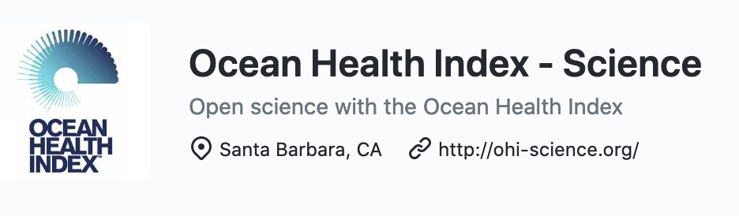
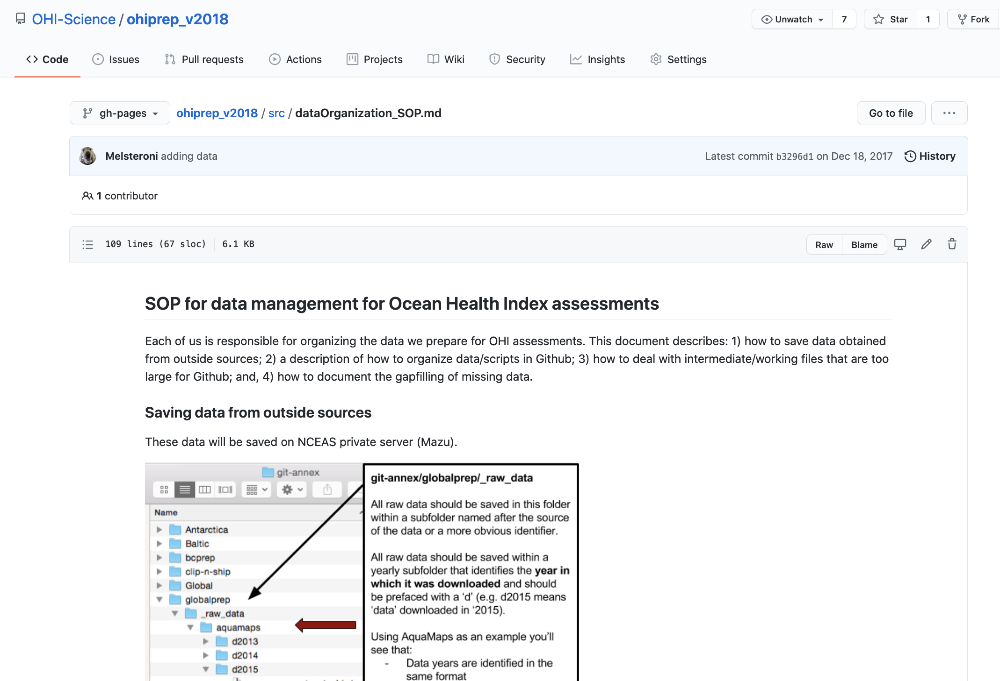
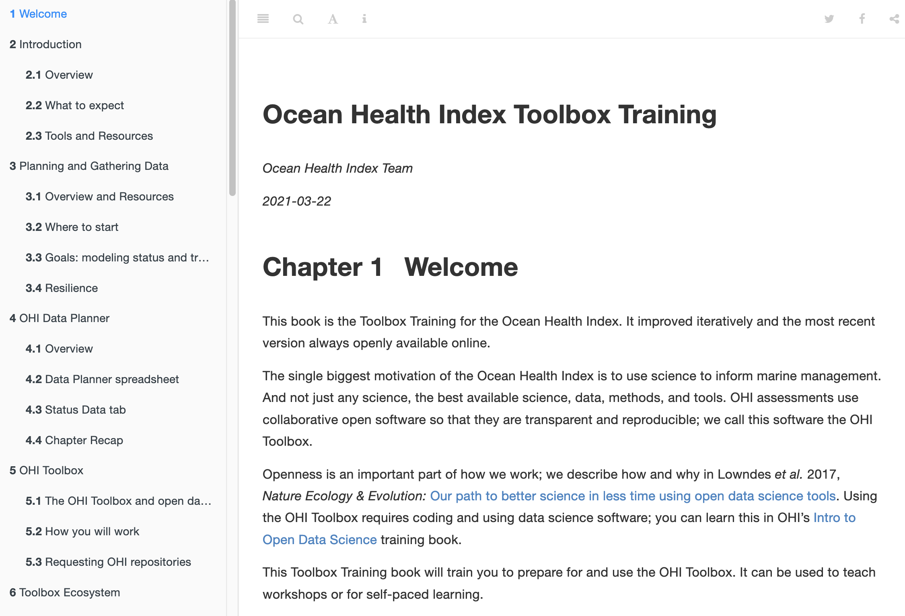
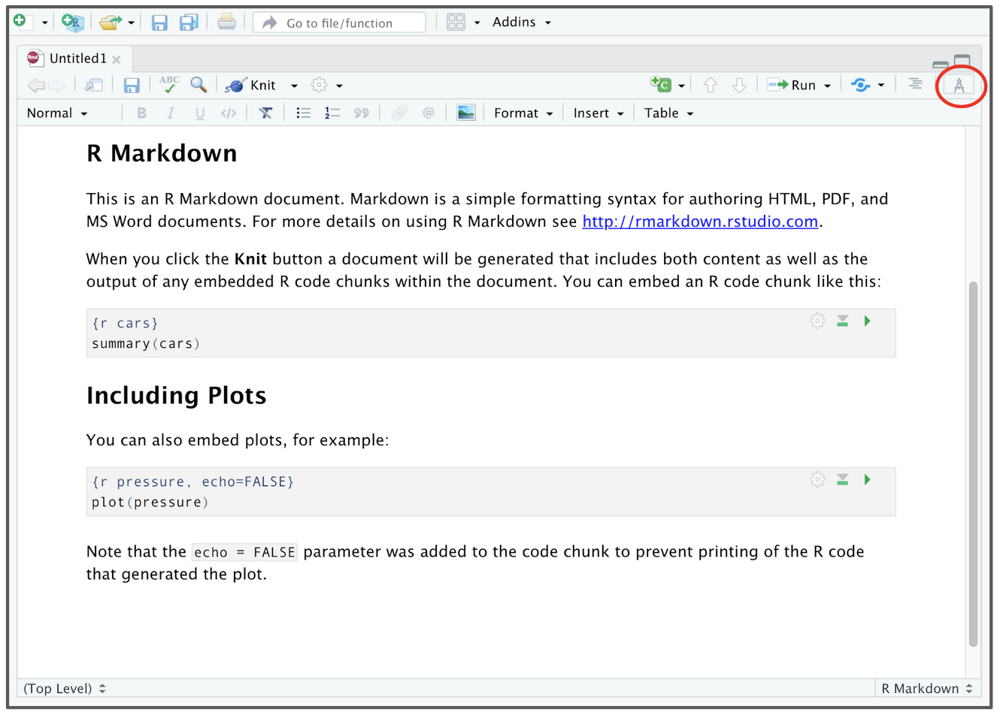
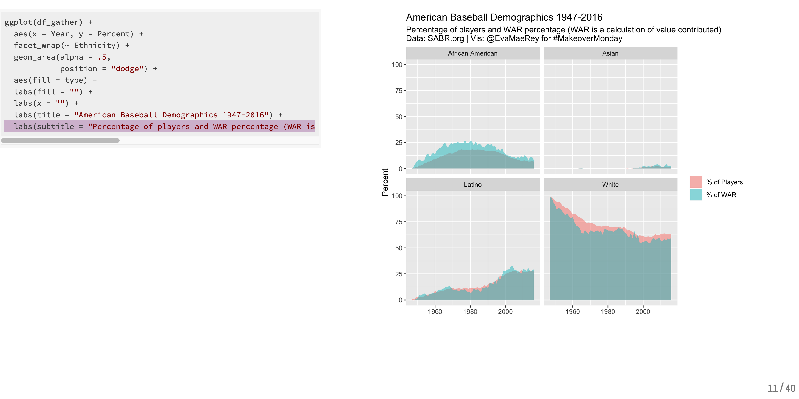

```{r setup, include=FALSE}
options(htmltools.dir.version = FALSE, warning=FALSE, message=FALSE, verbose = FALSE)
knitr::opts_chunk$set(echo = FALSE, message=FALSE, warning=FALSE)

library(xaringan)
# library(fontawesome) #devtools::install_github("rstudio/fontawesome")
# library(icon) #devtools::install_github("ropenscilabs/icon")
```

class: title-slide, right, bottom


## `r rmarkdown::metadata$title`
### `r rmarkdown::metadata$author`
### `r rmarkdown::metadata$institute`

[@juliesquid](https://twitter.com/juliesquid)  
[openscapes.org/media](http://openscapes.org/media)  


???

Thank you so much. I'm really excited to be here today to talk about Openscapes: Better Science for Future Us


Transition: the motivation for all my work now is that default approaches to data-intensive research feel like this. 

---
class: top, center
background-image: url(images/lowndes-2017-betterscience-table1.png)
background-position: 50% 90%
background-size: 95%

## OHI Team Pathway

???

We shared our story here about the tools. Table 1. I want to talk more about the behind-the-scenes, what we didn't describe in the paper but what is key to making this all happen. 

---
class: top, center
background-image: url(images/horst-seaside-chats.jpg)
background-position: 50% 90%
background-size: 60%


## Create space: how to talk about data
### "Seaside Chats"

???

Build trust, confidence talking about data and sharing imperfect work. 

Seaside chats. PI-supported, not attended. 
Seaside chats. Prioritize time. Shared space. Normalize. Build up space to ask these questions, develop vocabulary around them. (stuff from CSCCE slides?)
PI doesn't need more meetings. TRUST WITHIN TEAM. 

---
class: top, center
## Create place: where to put shared things

<br>

.pull-left[
### GitHub Organization

```{r ohi-gh-org, out.width = '90%', fig.align='center'}

```


*<https://github.com/ohi-science>*
]

.pull-right[
### Google Drive Folder

```{r gdrive, out.width = '60%', fig.align='center'}

```


]


???

GitHub Org, Google Drive.
And make sure everyone is comfortable using those tools. 
Michelle Fishbowl Chat.
GitHub Clinics.

---
class: top, center
## Create place: where to put shared things

<br>

.pull-left[
### GitHub Organization

```{r ohi-gh-org2, out.width = '90%', fig.align='center'}

```


*<https://github.com/ohi-science>*
]


.pull-right[
### Build trust, confidence, skills
```{r, eval=FALSE, echo=TRUE}
source("julies_script.R")
```
]

???
My R code was Not Great. Ugly, verbose, brittle, lots of repeating.
Nonetheless, saved as scripts, in a project-oriented workflow, shared via GitHub

---
class: top, center
## Create place: where to put shared things

<br>

.pull-left[
### GitHub Organization

```{r ohi-gh-org3, out.width = '90%', fig.align='center'}

```


*<https://github.com/ohi-science>*
]


.pull-right[
### Build trust, confidence, skills
```{r, eval=FALSE, echo=TRUE}
source("julies_script.R")

source("common.R")
```
]

???

Introduced style guide, tidyverse >> make it easier for code review
Scope of analysis: Data prep ended as tidy data, then modelling starts

---
class: top, center
## Create place: where to put shared things

<br>

.pull-left[
### GitHub Organization

```{r ohi-gh-org4, out.width = '90%', fig.align='center'}

```


*<https://github.com/ohi-science>*
]


.pull-right[
### Build trust, confidence, skills
```{r, eval=FALSE, echo=TRUE}
source("julies_script.R")

source("common.R")

remotes::install_github("ohicore")
```

*<https://github.com/ohi-science/ohicore>*
]

???

Common scripts, lookup tables >> eventually a package

---
class: top, center
## Identify shared needs

.pull-left[
### R & GitHub workflows

R functions & workflows  
Git/Hub with R  
R for Excel Users  
How do other people use R?

]

.pull-right[
### Team workflows
Name files  
Organize data in spreadsheets  
Good enough practices  
How do other people talk about data?
]


???

Identify how people work, identify the common parts where we are all reinventing. One concrete example: we were all spending a ton of time with Country names. 

Let me started talking about data and analysis we realized they were tedious common things we were all doing whether that was consolidating species names or location names saving data making plots we were all reinventing so through talking about this we were able to start putting that common code somewhere else where we could all you know somewhere where we could all access it and then normalize doing that this then let us find other common not only common problems but common ways to innovate together and take the next step we work on common documentation and then common automation and upskilling.


eg: https://github.com/OHI-Science/ohiprep_v2020/blob/gh-pages/workflow/R/common.R

---
class: top, center
## Address shared needs

.pull-left[
### R & GitHub workflows

[R for Data Science](https://r4ds.had.co.nz) - Wickham & Grolemund  
[Happy Git with R](https://happygitwithr.com) - Bryan et al  
[R for Excel Users](https://rstudio-conf-2020.github.io/r-for-excel/) - Lowndes & Horst  
[We Are RLadies (Twitter)](https://twitter.com/wearerladies) - RLadies Global

]

<!---
2021 slight update from OHI's [Lowndes et al. 2017](https://www.nature.com/articles/s41559-017-0160)]
--->

.pull-right[
### Team workflows
[How to Name Files](https://speakerdeck.com/jennybc/how-to-name-files?slide=1) - Bryan  
[Data Organization in Spreadsheets](https://peerj.com/preprints/3183/) - Broman & Woo  
[Good Enough Practices](https://journals.plos.org/ploscompbiol/article?id=10.1371/journal.pcbi.1005510#) - Wilson et al  
[Not So Standard Deviations](https://nssdeviations.com/) - Parker & Peng 
]

<br>

### seaside chats • lab "hackathons" • coding clubs • blogs • slides • tutorials • (un)conferences 

???

Introduced style guide, tidyverse >> make it easier for code review
Scope of analysis: Data prep ended as tidy data, then modelling starts
Common scripts, lookup tables >> eventually a package
Scope of scripts: modular preferred to long epic tome (iterative)
OHI Hackathons: e.g. main lookup table, purge plyr, reorg ohicore
Migrated from .R to .Rmd: share methods/instruction, pub’d via GitHub 


---
class: top, center
background-image: url(images/horst-workflow.png)
background-position: 50% 90%
background-size: 80%

## Address shared needs

.footnote[[Allison Horst](https://www.allisonhorst.com/)]

---
class: top, center
## Think ahead for Future Us 

```{r ohi-sop, out.width = '80%', fig.align='center'}

```

---
class: top, center
## Think ahead for Future Us 

```{r ohi-tbx, out.width = '80%', fig.align='center'}

```

---
class: top, center
## Think ahead for Future Us 

.pull-left[
### RStudio Visual Editor

```{r rstudio-ve, out.width = '90%', fig.align='center'}

```

*<https://rstudio.github.io/visual-markdown-editing>*
]


.pull-right[
### Slides with R: `xaringan`
```{r xaringan, out.width = '90%', fig.align='center'}

```

<br>

*<https://bookdown.org/yihui/rmarkdown/xaringan>, <http://arm.rbind.io/slides/xaringan>, https://evamaerey.github.io/ggplot_flipbook*
]

---
exclude: TRUE
class: top, center
## Think ahead for Future Us 

```{r community-logos, out.width = '100%', fig.align='center'}
knitr::include_graphics("images/ods-community-logos.png")
```


### [rOpenSci](https://ropensci.org) • [RStudio](https://rstudio.com) • [Mozilla](https://mozilla.org) • [RLadies](https://rladies.org) • [Carpentries](https://carpentries.org/)  


